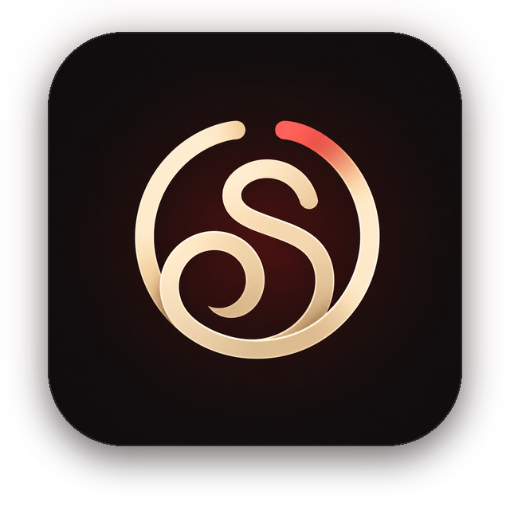
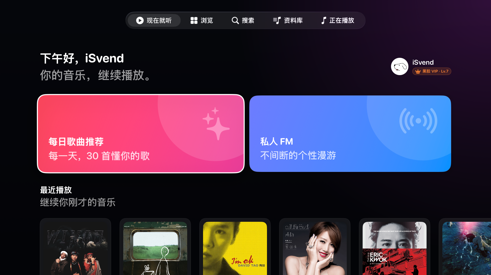
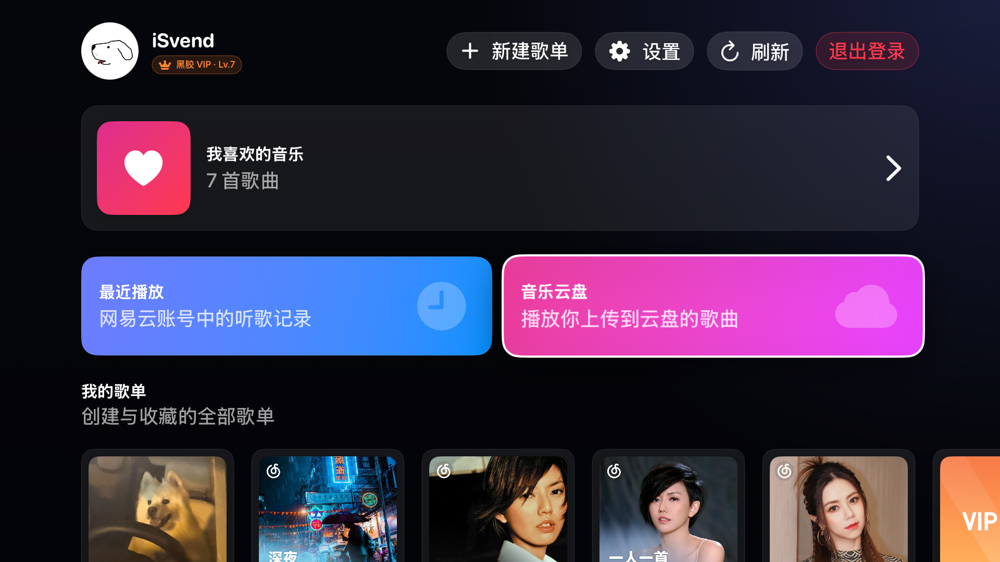
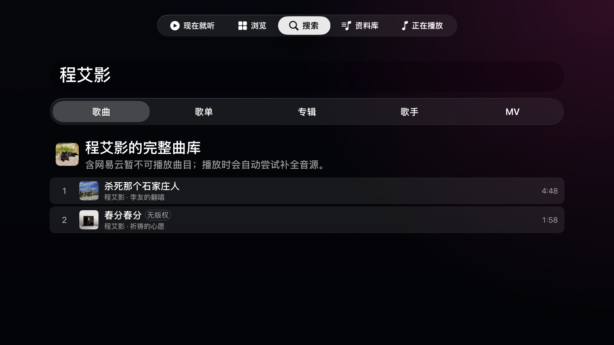
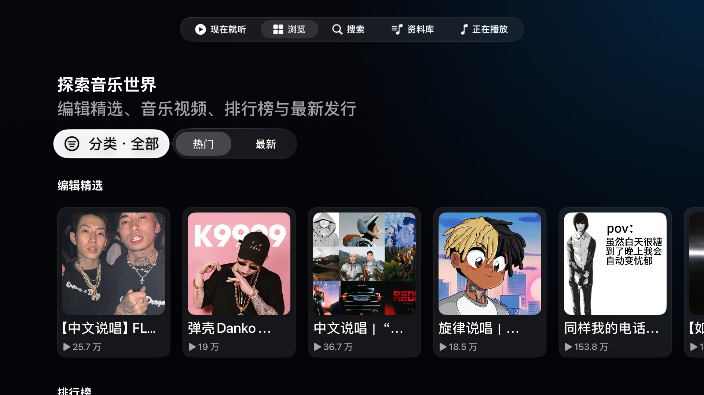
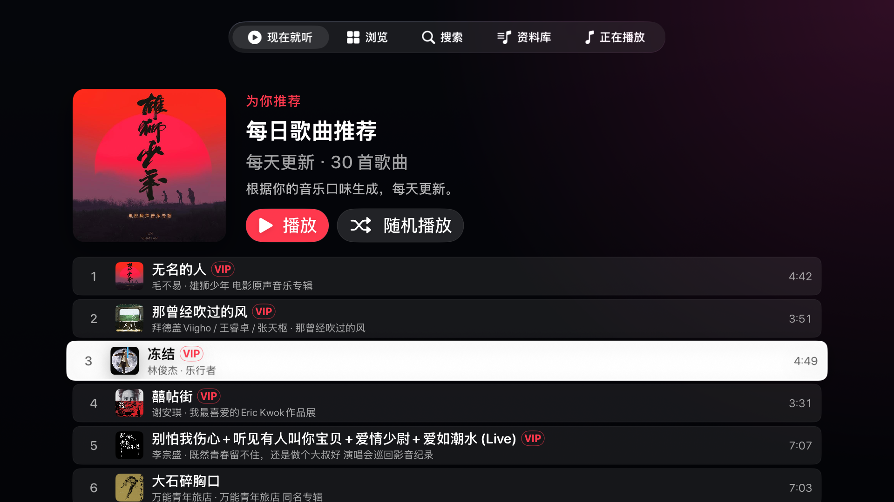
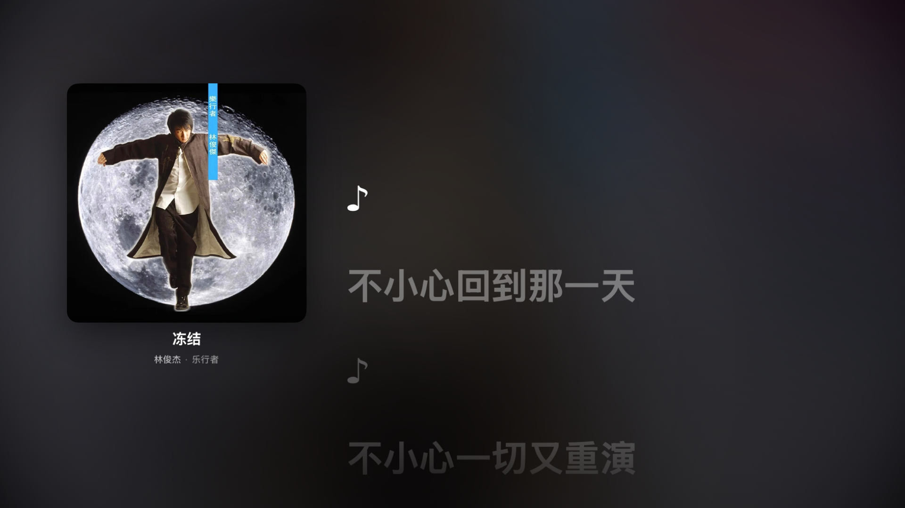
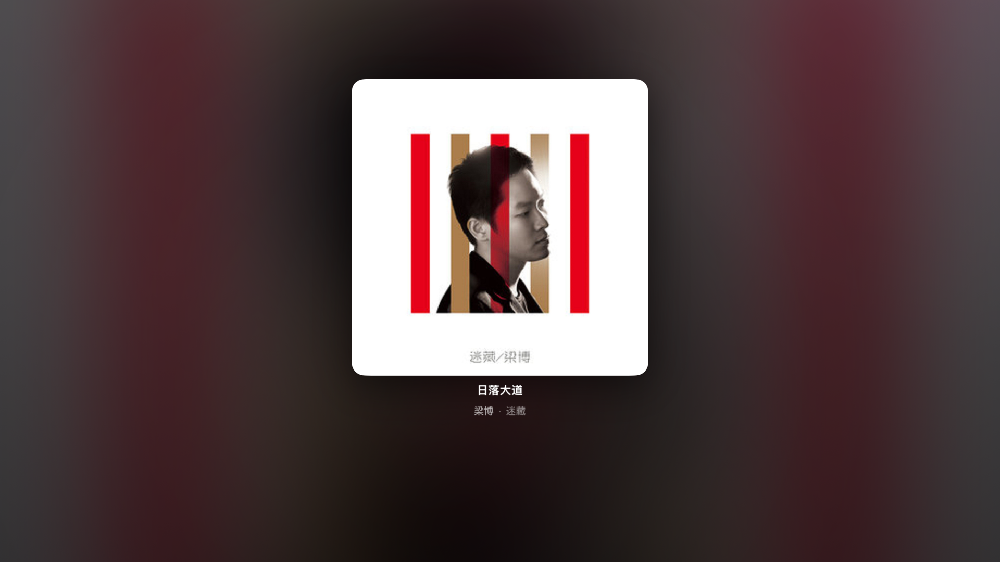

<p align="center">
  
</p>

<h1 align="center">云音厅 · Sonimbus</h1>

<p align="center"><strong>把云里的歌，带进客厅。</strong></p>

<p align="center">为 Apple TV 打造的原生网易云音乐客户端</p>
<p align="center">SwiftUI 编写 · 直连网易云真实 API · 面向 tvOS 遥控器重新设计</p>

## 名字由来

`Sonimbus` 由 sound / sonic 与 nimbus（云）组合而来，延续“云的声音”这个意象。中文名「云音厅」中的“厅”既是音乐厅，也是 Apple TV 所在的客厅。

## 界面

<p align="center">
  
</p>

<p align="center">
  
  
</p>

<p align="center">
  
  
</p>

<p align="center">
  
</p>

<p align="center">
  
</p>

## 功能

- 🔐 **扫码登录** — 使用网易云音乐 App 扫码，Cookie 本地持久化并自动刷新
- 🏠 **个性推荐** — 每日歌曲、私人 FM、心动模式、推荐歌单、新歌与最近播放
- 🧭 **大屏浏览** — 精选歌单分类、热门 / 最新排序、排行榜、音乐视频、新专辑与热门歌手
- 🔍 **完整搜索** — 搜索歌曲、歌单、专辑、歌手与 MV，支持推荐词、最近搜索和连续分页
- 📚 **个人资料库** — 喜欢的歌曲、收藏歌单与专辑、关注歌手、播放记录和音乐云盘
- ✏️ **歌单管理** — 创建、删除、收藏和编辑歌单，添加或移除歌曲，支持 HTTPS 封面链接
- ☁️ **音乐云盘** — 播放、删除、曲目匹配，并通过 HTTPS 音频直链上传
- 🎵 **播放与队列** — 下一首播放、添加到队列、随机、单曲循环、列表循环、进度拖动和跨启动恢复
- 📝 **沉浸歌词** — LRC 同步歌词、翻译与罗马音，遥控器逐行选择并跳转播放
- 🖼 **全屏播放页** — 封面取色背景、大封面、歌词、待播清单、AirPlay 与歌曲详情
- 🎬 **音乐视频** — 个性化和最新 MV 浏览、内嵌预览、系统全屏时间轴、快进快退与上下文连播
- 🔓 **不可用歌曲补全** — 网易云地址缺失或加载失败时，按名称、歌手和时长尝试匹配公开音源
- 🔊 **音质选择** — 标准、较高、极高、无损和高解析度无损，不可用时自动回退
- 📺 **tvOS 系统集成** — 原生焦点交互、Remote Command、系统 Now Playing 与后台音频

## 安装

### 未签名 IPA

从 [GitHub Releases](https://github.com/gee1k/sonimbus/releases) 下载最新的 `Sonimbus-tvOS-*-unsigned.ipa`，使用支持 tvOS 的签名工具以自己的 Apple Account 重新签名后安装。

[Sideloadly](https://sideloadly.io/) 支持在 macOS 上与 Apple TV 配对并安装 tvOS IPA。免费 Apple Account 签名的应用通常需要每 7 天重新签名；使用第三方签名工具前，请自行了解其账号处理方式和使用风险。

也可以按照下方步骤从源码直接使用 Xcode 运行。

## 环境

- macOS 15 或更高版本
- Xcode 26 或更高版本
- 最低支持 tvOS 17
- 模拟器运行不需要配置代码签名
- 真机运行需要在 Xcode 中登录 Apple Account 并选择自己的 Team

## 构建与运行

### 模拟器

1. 使用 Xcode 打开 `Sonimbus.xcodeproj`。
2. 选择 `Sonimbus` scheme。
3. 选择一个 Apple TV 模拟器。
4. 点击运行，使用手机网易云音乐 App 扫描电视上的二维码。

命令行无签名编译：

```bash
xcodebuild -project Sonimbus.xcodeproj \
  -scheme Sonimbus \
  -sdk appletvsimulator \
  -derivedDataPath build/DerivedData \
  CODE_SIGNING_ALLOWED=NO build
```

### 真机签名

1. 在 Xcode 的 **Settings → Accounts** 中登录自己的 Apple Account。
2. 打开 `Sonimbus` target 的 **Signing & Capabilities**，启用自动签名并选择自己的 Team。
3. 将 `com.svend.sonimbus` 改成属于自己的唯一 Bundle ID，例如 `com.example.sonimbus`。
4. 选择已连接的 Apple TV 后运行。

### 本地打包

没有开发证书时，可以生成供用户自行签名的未签名 IPA：

```bash
./Scripts/package-unsigned-ipa.sh
```

输出路径包含工程当前的营销版本和 Build Number，例如：

```text
build/unsigned/1.1.0/1/Sonimbus-tvOS-1.1.0-build.1-unsigned.ipa
```

无签名 IPA 不能直接安装到 Apple TV，也不能上传 TestFlight；需要先使用用户自己的 Apple Account 完成签名。

## 测试

运行 Swift 单元测试：

```bash
swift test
```

执行真实网易云公开接口冒烟测试：

```bash
NETEASE_API_SMOKE=1 swift test --filter liveAPISmokeTest
```

## 架构

```text
Sonimbus/
├── App/             # 应用入口、根标签页、导航与焦点恢复
├── Core/            # API、数据模型、账号、内容状态、播放器与音源补全
├── DesignSystem/    # tvOS 主题、按钮、卡片、焦点样式与通用组件
├── Features/        # 推荐、浏览、搜索、资料库、详情与全屏播放页
└── Resources/       # Info.plist、App Icon 与 Top Shelf 资源
```

应用使用原生 Swift 实现网易云 `weapi` / `eapi` 加密，请求直达 `music.163.com` 与 `interface.music.163.com`，不依赖自建 API 服务。

## Credits

云音厅在网易云协议、接口行为、兼容数据模型、歌词解析和不可用歌曲补全策略方面参考并改编自以下开源项目：

- [missuo/kumone](https://github.com/missuo/kumone)（LGPL-3.0-only）— 网易云协议、端点、模型、歌词与补全策略
- [UnblockNeteaseMusic/server](https://github.com/UnblockNeteaseMusic/server)（LGPL-3.0-only）— 第三方音源接口与匹配策略
- [NeteaseCloudMusicApiEnhanced/api-enhanced](https://github.com/NeteaseCloudMusicApiEnhanced/api-enhanced)（MIT）— 云盘与歌单资料相关接口行为

tvOS 应用架构、电视界面、遥控器焦点交互和分发脚本由本项目独立实现。具体引用版本、适用许可证和实现边界见 [THIRD_PARTY_NOTICES.md](THIRD_PARTY_NOTICES.md) 与 [Licenses](Licenses)。

## 协议与说明

本项目以 [LGPL-3.0-only](LICENSE) 协议完整开源，仅供学习、研究和个人使用。

云音厅是非官方客户端，与网易云音乐、网易、Apple 或 Kumone 项目作者均无隶属或合作关系。音乐、封面、歌词、视频和账号数据的权利归相应权利人所有。使用者应自行遵守相关服务条款、内容授权和所在地法律。
